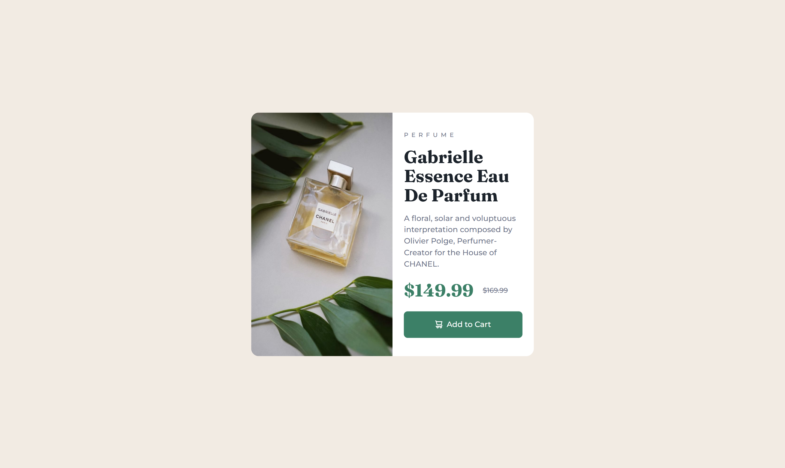

# Frontend Mentor - Product preview card component solution

This is a solution to the [Product preview card component challenge on Frontend Mentor](https://www.frontendmentor.io/challenges/product-preview-card-component-GO7UmttRfa). Frontend Mentor challenges help you improve your coding skills by building realistic projects. 

## Table of contents

- [Overview](#overview)
  - [The challenge](#the-challenge)
  - [Screenshot](#screenshot)
  - [Links](#links)
- [My process](#my-process)
  - [Built with](#built-with)
  - [What I learned](#what-i-learned)
  - [Useful resources](#useful-resources)
- [Author](#author)

## Overview

### The challenge

Users should be able to:

- View the optimal layout depending on their device's screen size
- See hover and focus states for interactive elements

### Screenshot



### Links

- Solution URL: [Github](https://github.com/shadowbanks-frontendmaster-challenges/productPreview)
- Live Site URL: [Github pages](https://shadowbanks-frontendmaster-challenges.github.io/productPreview/)

## My process

### Built with

- Semantic HTML5 markup
- Flexbox
- Mobile-first workflow
- [Scss](https://sass-lang.com/guide/#modules) - CSS extension language


### What I learned

I learnt how to use SCSS/SASS I must say it's pretty cool, I went through the docs for sass, less and stylus and compared them, I eventually decided on sass.


```css
$breakpoint-mobile: 30rem;
$breakpoint-tablet: 38rem;
$breakpoint-desktop: 64rem;

@mixin respond_to($breakpoint) {
  @if $breakpoint == tablet {
    @media (min-width: $breakpoint-mobile) {
      @content;
    }
  } @else if $breakpoint == desktop {
    @media (min-width: $breakpoint-tablet) {
      @content;
    }
  }
}
```

### Useful resources

- [Sass docs](https://sass-lang.com/guide/) - This sass official docs got me up to speed with the basic really quickly.

## Author

- Frontend Mentor - [@shadowbanks](https://www.frontendmentor.io/profile/shadowbanks)
- X(Twitter) - [@Shadowbanks_](https://x.com/Shadowbanks_)
